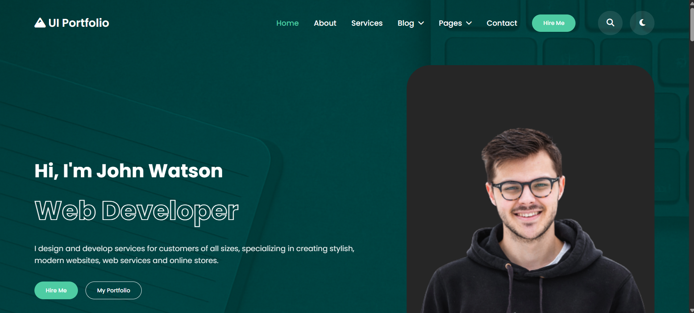
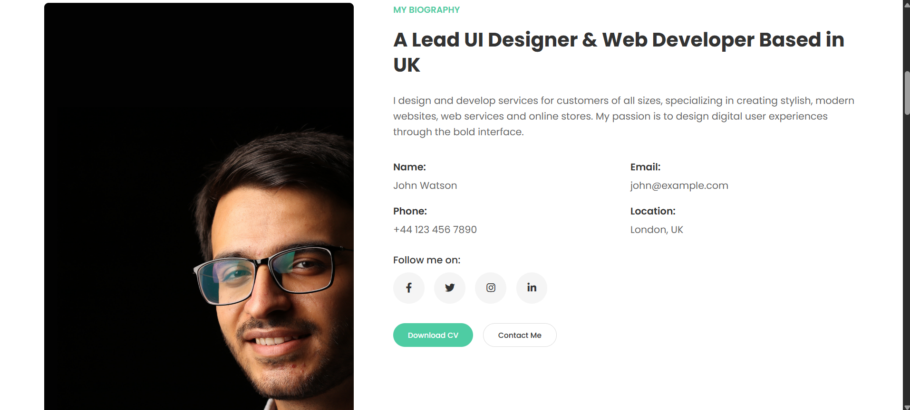
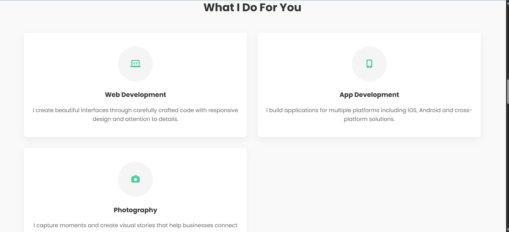
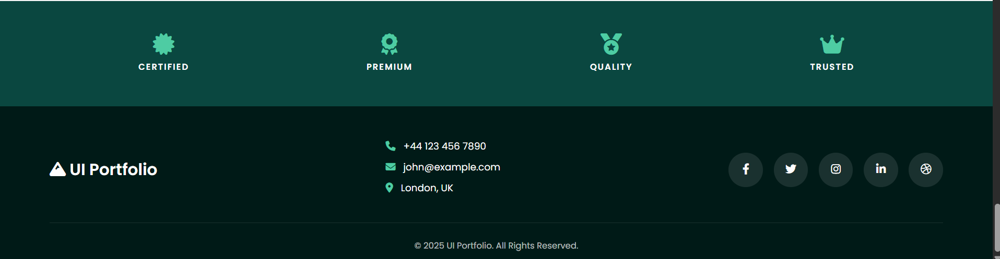

# UI Portfolio Website

## Project Overview
This project is a **UI Portfolio Website** designed to showcase the skills, services, and portfolio of a professional web developer and UI/UX designer. The website is fully responsive and includes modern design elements to provide an engaging user experience.

## Goals and Objectives
The primary objectives of this project are:
1. **Showcase Professional Skills**: Highlight the developer's expertise in web development, UI/UX design, and other related services.
2. **Display Portfolio**: Present a collection of completed projects in an organized and visually appealing manner.
3. **Promote Services**: Provide detailed information about the services offered, such as web development, app development, and photography.
4. **Engage Visitors**: Include interactive elements like dropdown menus, hover effects, and responsive design to enhance user engagement.
5. **Encourage Contact**: Provide easy access to contact information and social media links to facilitate communication with potential clients.

## Key Features
### Based on `index.html`
- **Header Navigation**: A responsive navigation bar with dropdown menus for "Blog" and "Pages," a "Hire Me" button, and icons for search and theme toggle.
- **Hero Section**: A welcoming introduction with a professional portrait, a brief description, and call-to-action buttons.
- **About Section**: A biography section with personal details, social media links, and buttons for downloading the CV or contacting the developer.
- **Services Section**: A grid layout showcasing the main services offered, with icons and descriptions.
- **Skills Section**: A visual representation of skills using progress bars to indicate proficiency levels.
- **Portfolio Section**: A gallery of completed projects with hover effects and links for more details.
- **Clients Section**: A section highlighting certifications and trust indicators.
- **Footer**: A footer with contact information, social media links, and copyright details.

### Based on `styles.css`
- **Modern Design**: Clean and professional design with a focus on typography, spacing, and color schemes.
- **Responsive Layout**: Media queries ensure the website adapts seamlessly to different screen sizes, including desktops, tablets, and mobile devices.
- **Interactive Elements**: Hover effects, dropdown menus, and animations for a dynamic user experience.
- **Consistent Branding**: A cohesive color palette featuring shades of green (#4ecca3) and dark tones (#0a4740) for a professional look.
- **Accessibility**: Font sizes, contrast, and spacing are optimized for readability and usability.

## Technologies Used
- **HTML5**: For structuring the content of the website.
- **CSS3**: For styling and layout, including animations and responsive design.
- **Font Awesome**: For icons used throughout the website.
- **Google Fonts**: For typography (Poppins font family).

## Future Enhancements
- Add JavaScript functionality in `script.js` for features like theme toggling, form validation, and dynamic content updates.
- Integrate a backend to handle contact form submissions and manage portfolio items dynamically.
- Optimize images and assets for faster loading times.

## How to Use
1. Clone the repository to your local machine.
2. Open `index.html` in a browser to view the website.
3. Modify the content in `index.html` and `styles.css` to customize the portfolio.

## Live Demo
Check out the live version of the website here: [UI Portfolio Website](https://group-portfolio-tau.vercel.app/)

## Screenshots
A snippet of what the site looks like:
### Homepage

### About Section

### Services Section

### Footer Section

## Contributors
This project was collaboratively developed by the following team members:

- **Grace Wambui** - wambuigm55@gmail.com
- **Said Maalim** - saidibrah06@gmail.com
- **klaas Matlou** - tshupianematlou@gmail.com
